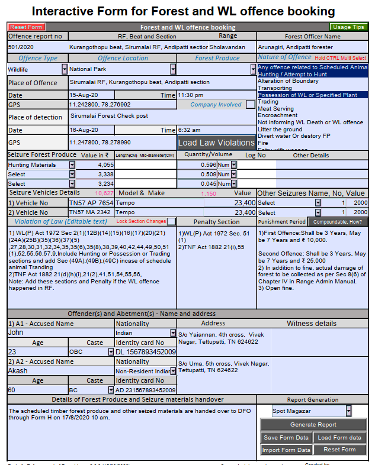

# Forest-WL-Law

## Introduction
Enforcement of Forest-WL-Law application provides a PDF interactive form to know **forest and Wildlife offence sections and generate documents to prosecute the offence**. It's a guideline for booking offences. **This is an interactive form of "Enforcement of forest law 2.0"**, which is an extraction of 20+ TN forest and WL law. This Interactive form has taken care of most of the ifs and buts and made it simple to choose the required fields to know the offence sections. In the current state, the application's scheduled Timber and non-Scheduled Timber offence sections are created for TN Forest staff. Wildlife offence and Biodiversity sections are for across India. The Biodiversity section contains TN Biodiversity act sections as well. Request to replace this TN BD act with appropriate state BD Act.  

## Humble Request
I request the forest official to understand the section and its implication before booking offence.  I request a decision to take based on the gravity of offence. **Prosecution power must not be misused to litigate human life. Use these sections cautiously and Judicially**.

## Usage instruction
This PDF interactive form is designed to work in personal computers. It will not work using mobile "PDF Reader" applications except Foxit PDF Reader.
Read the tooltip for each field for more usage information.

## Requirements and usage instructions
"Enforcement of Forest and Wildlife law 2.0" is a requirement document for this application. Use this interactive form for the following requirement. Use free version of [Acrobat Reader DC](https://get2.adobe.com/uk/reader) or [Foxit Reader](https://www.foxitsoftware.com/pdf-reader) to fill this form. Saving this interactive form file in predefined location or load the form data file will work only in Foxit Reader.

### 1. To know Forest, WL and BD law sections for an offence
* Fill Blue color and italic font form fields and then click "Load Law Violations" button. Select all possible offences in "Nature of Offence" list box by holding CTRL key.
* Read each law and then apply only the required section for your case

### 2. To know an offence is compoundable or non-compoundable and its law reference
* For WL offence, load the offence details mentioned in point 1 and then click "Non-Compoundable, How?" button.
* For ST/Non-ST, load the FP seizure details and then click "Non-Compoundable, How?" button.

### 3. To know ST/Non-ST Timber volume calculation. (Formerly known as Quarter Girth Formula)
* Fill Seizure FP, Length, mid-diameter (centimetre) to auto populate Volume in cubic meters.
* Volume calculation is not applicable for Sandal Wood.

### 4. To generate case documents  
Seizure List in Form H, Measurement List, Confession Statement, Spot Magazar (Possession, Transportation, Attempted to transport, No-seizure involved), Form 95, Remand Report, Bail Objection and Form A documents can be prepared.

* Fill all the possible form fields
* Select all the possible offence committed (Example: Scheduled Animal + Hunting + Possession or transport)
* Invoke the "Load Violation of Law" button
* Make the required changes (remove unwanted sections) in the "Violation of Law" field. Enable the "Lock Section changes" Checkbox to prevent accidental changes
* Use `Ctrl + S` to save the form in local disk
* Choose the report that you want to generate and then click the "Generate Report" button
* Copy the data populated in page 2 to MS word and make further required changes
* Use the "Save Form Data" button to save this data in the local system("D:\ForestOffence.fdf"). You can send this file to anyone or save it for later usage
* Use "Load Form Data" to load the previously saved data
* Use "Import Form Data" to load external form data

### Known restrictions
1. "Save form data" don't work in Adobe Reader. Adobe doesn't allow you to save data locally through scripting. Use Foxit reader to get rid of this issue.
2. Mobile device: Use Foxit PDF Android/iOS version. "Adobe form" Android App is not supporting interactive form well."
3. For BD Act, Prosecution documents or reports are not available now.  

### Usage Tips
1. Multi selection is enabled in the "Nature of offence" list box. Use the `CTRL` key for multi selection.
2. "Seizure forest Produce" dropdown field value can be edited or new value can be added depending on the requirement. Use the "other details" field to give more details. Reports are generated based on the first "Seizure forest produce" dropdown values (first row).
3. This form is pre-filled with sample data to experience the functionality. Use the "Reset Form" functionality to clear the existing data.

### Sample screen shot


## Why PDF interactive form was selected to meet this requirement
"Interactive PDF form" solution has been chosen to implement these requirements to ensure the security of its user's activity in personal computer, to work without internet connectivity and use mostly available software in personal computer to avoid additional installation. From the security perspective, PDF readers don't allow to save file/data in local storage, and don't allow to track or monitor the users mobile/desktop activities in foreground or background. Mobile application or Web application will be a backbox for it's users and potential to track users' other activities and their movements. To maintain safety and security, this PDF form application won't allow to save file/data locally other than one predefined file said in this document. Even this functionality is prohibited in Adobe PDF reader/Writer. Few PDF readers, allow to save the file in predefined location with predefined file name. PDF interactive form has been chosen based on these criteria.  

## For contributors: Who are interested to add more capabilities or customize the application to meet their requirement
Forest-WL-Law application is built with PDF javascript APIs. Package layout section contains the instructions for this OSS code. Those who want an application for other state need to customize the `forestOffence.js` file with their appropriate law. Use `Adobe PDF writer` or `Foxit PhantomPDF` to add the given `javascript` files for customization or enhancement.

### Area for contribution
Each south state has their own forest law derived from Madras Forest Act and Most of the other Indian states follow Indian forest Act 1927. Create a state specific `ForestOffence.js` file with your state specific law knowledge to customize this application for your state. Please raise a git issue if there is a prosecution procedure difference in your state.  

### Package Layout
```
├── README.md                                   # This file
├── Forest and WL Offence Booking.PDF           # Interactive form (dropdowns/list box/push button selection triggers action event or item change event)      
├── FormData.js                                 # All the dropdown, list box values are available in this file
│── FormDataObject.js                           # It holds FormData json object fields and its related set/get functionality
├── ForestOffence.js                            # All forest/BD offence violation sections, Penalty sections, Punishment periods are available in this section
├── WLOffence.js                                # All WL offence violation sections, Penalty sections, Punishment periods are available here
├── ReportTemplates.js                          # All the Prosecution documents or reports are generation functionalities are documented here
│── OffenceBooking.js                           # Its a main program which read the properties from other JS. The full application logic are available here
│── documentTemplates                           # This folder contains all the sample document templates
```
